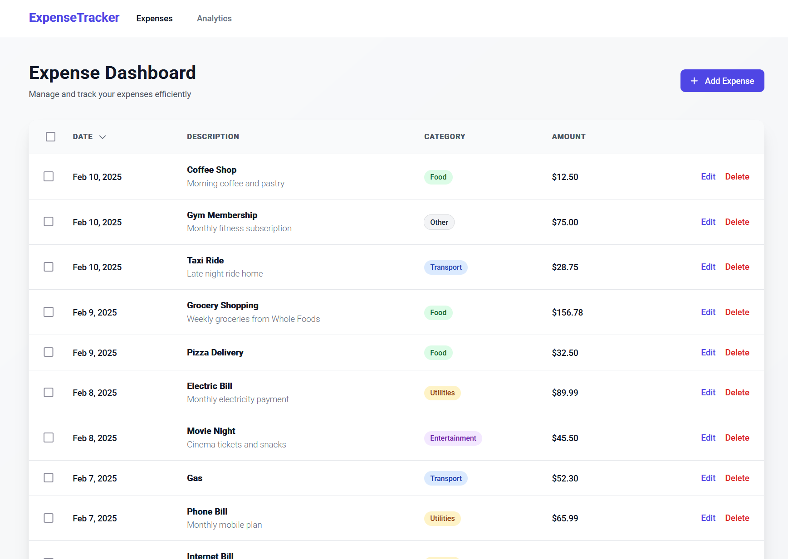
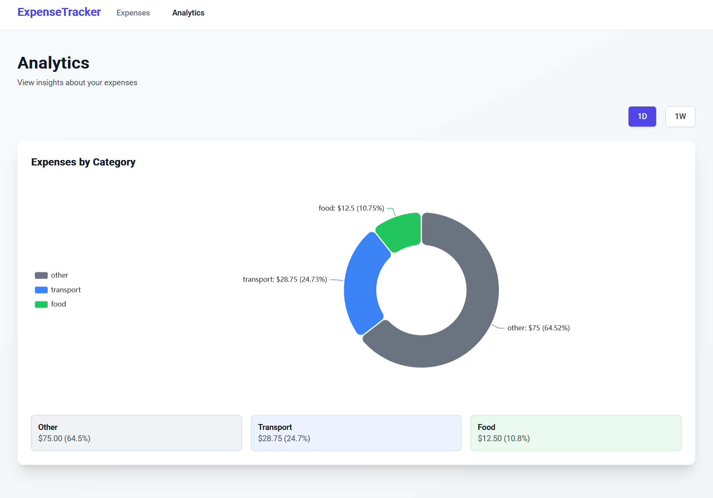

# Expense Tracker

A modern, responsive expense tracking application built with Angular 17, featuring Material Design components and interactive charts.

## Features

- **Dashboard Page**

  - View all expenses in a sortable table
  - Add, edit, and delete expenses
  - Bulk delete functionality
  - Filter and sort expenses by date, description, category, and amount
  - Responsive design for all screen sizes

- **Analytics Page**
  - Interactive pie chart showing expense distribution by category
  - Time-based filtering (1 Day, 1 Week)
  - Category-wise expense breakdown with percentages
  - Real-time updates when data changes

## Technology Stack

- Angular 17
- Angular Material
- Tailwind CSS
- ECharts (via ngx-echarts)
- TypeScript

## Prerequisites

- Node.js (version 18 or higher)
- npm (comes with Node.js)

## Getting Started

1. Clone the repository:

   ```bash
   git clone [your-repository-url]
   cd expense-tracker
   ```

2. Install dependencies:

   ```bash
   npm install
   ```

3. Start the development server:

   ```bash
   npm start
   ```

4. Open your browser and navigate to `http://localhost:4200`

## Available Scripts

- `npm start` - Starts the development server
- `npm run build` - Creates a production build
- `npm run watch` - Builds the project in watch mode
- `npm test` - Runs unit tests

## Project Structure

```
src/
├── app/
│   ├── components/
│   │   ├── analytics/        # Analytics page component
│   │   ├── dashboard/        # Main dashboard component
│   │   ├── add-expense-modal/# Modal for adding expenses
│   │   ├── confirmation-dialog/# Confirmation dialog component
│   │   └── layout/          # Main layout component
│   ├── models/
│   │   └── expense.model.ts # Expense interface definition
│   ├── services/
│   │   ├── expense.service.ts# Expense data management
│   │   └── state.service.ts # Application state management
│   └── app.routes.ts        # Application routing
└── styles.scss              # Global styles
```

## Features in Detail

### Expense Management

- Create new expenses with description, amount, category, and notes
- Edit existing expenses
- Delete single or multiple expenses
- Categorize expenses (Food, Transport, Utilities, Entertainment, Other)

### Analytics

- Visual representation of expenses using pie charts
- Category-wise expense breakdown
- Time-based filtering options
- Percentage distribution of expenses

### Data Persistence

- All data is stored in the browser's localStorage
- Sample data is automatically loaded on first run

## Building for Production

To create a production build:

```bash
npm run build
```

This will create a production-ready build in the `dist/expense-tracker/browser` directory.

## Running Tests

```bash
npm test
```

## Contributing

1. Fork the repository
2. Create your feature branch (`git checkout -b feature/AmazingFeature`)
3. Commit your changes (`git commit -m 'Add some AmazingFeature'`)
4. Push to the branch (`git push origin feature/AmazingFeature`)
5. Open a Pull Request

## License

This project is licensed under the MIT License - see the LICENSE file for details

## Screenshots




